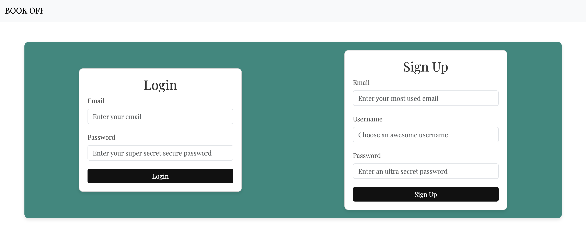
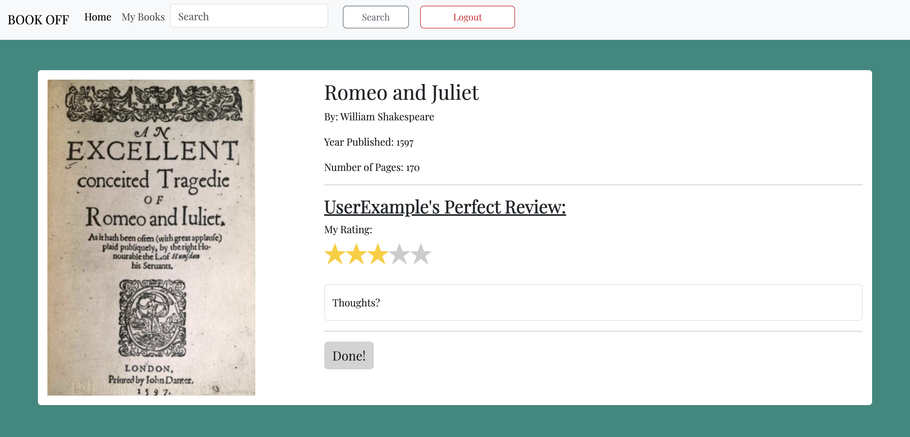

# book-off

## Table of Contents

 - [Description](#description)
 - [User Story](#user-story)
 - [Acceptance Criteria](#acceptance-criteria)
 - [Installation](#installation)
 - [Images](#images)
 - [Deployment Link](#deployment-link)
 - [Credits](#credits)
 - [License](#license)

## Description

Our team designed an application that used the MVC paradigm, created our own server-side API, added user authenication, and connected to a database. The user is able to log into their profile where they are brought to a homepage with suggested books to read, search for their desired book, and review books that are saved to their local storage. Users are able to view other user's comments that they have made.

## User Story

As a book reader, I want a website that will keep track of my personal ratings so that I can look back on what I have read and get recommendations on what to read in the future.

## Acceptance Criteria

 - Given a website
 - When I visit the site
 - Then I am able to sign up for an account or login into an existing one
 - When I am logged in
 - Then I can see books I may like and popular books 
 - When I see the book a person has rated
 - Then I am able to comment on the review and leave a rating.
 - When I visit my profile page 
 - Then I can see all my reviews
 - When I search a book
 - Then I can leave a rating and / or a review
 - When I click on reply on a review
 - Then I can leave a comment

## Installation

 - Node, 'npm init'
 - Express, 'npm i express@4.17.1'
 - Express Handlebars, 'npm i express-handlebars'
 - Express session, 'npm i express-session'
 - MySQL2, 'npm i mysql2'
 - Sequelize, 'npm i sequelize'
 - Dotenv package, 'npm i dotenv'
 - bcrypt package, 'npm i bcrypt'
 - Connect-session-sequelize, 'npm i connect-session-sequelize'
 - Bootstrap, 'npm i bootstrap@5.3.2'

## Images

### Login Page

### Home Page

### Review Page Example

### My Books Page Example

## Deployment Link

Heroku Link: https://book-off-866229c3cfd8.herokuapp.com/

## Credits

 - Webpage by: Nick Almond, Peyton Weber, Matthew Rallo, Sarah Padilla
 - Institution: WashU in St. Louis
 - Course: Bootcamp Full Stack Development
 - Instructors: Brett Gaynor, Chris Pesar

## License

